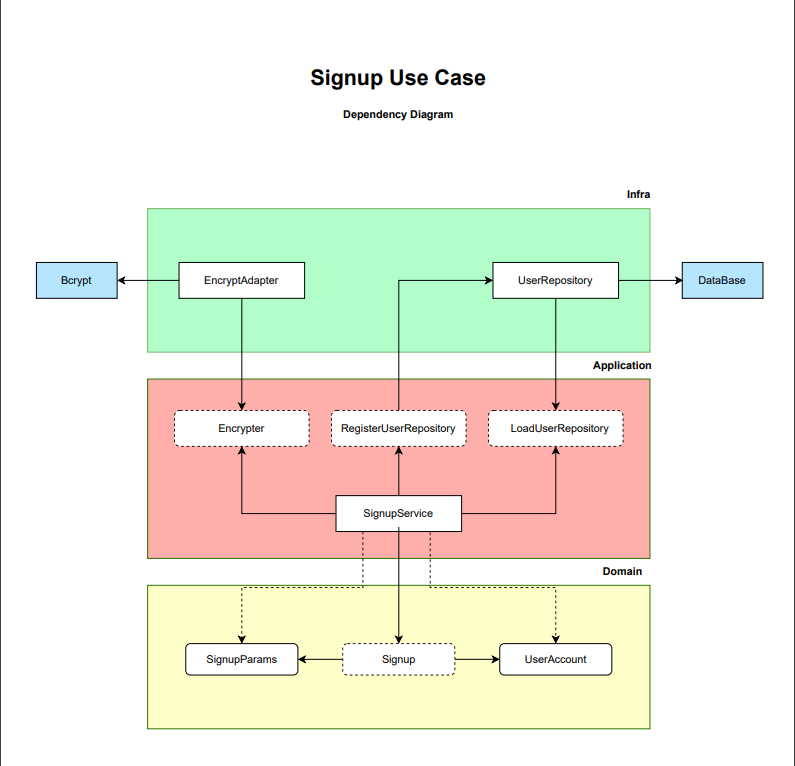

# Ride App Backend Project

## Overview

Este projeto é um backend para um serviço de ride-hailing (aplicativo de transporte) desenvolvido em TypeScript. Ele segue princípios de Clean Code, Clean Architecture, SOLID e Test-Driven Development (TDD). O foco principal está nas camadas de domínio e aplicação do sistema.

## Table of Contents

- [Project Structure](#project-structure)
- [Technologies Used](#technologies-used)
- [Setup Instructions](#setup-instructions)
- [Running Tests](#running-tests)
- [Implemented Features](#implemented-features)
- [Key Design Considerations](#key-design-considerations)
- [Team Members](#team-members)

## Project Structure

```

jest.config.ts
package.json
README.MD
src/
  features/
    signup/
      application/
        contracts/
          user-repository.ts
        errors/
          car-plate-is-required-error.ts
          email-already-exists-error.ts
          passenger-should-not-have-car-plate-error.ts
        services/
          signup-service.ts
      domain/
        contracts/
          signup.ts
        entities/
          user-account.ts
tests/
  features/
    signup/
      application/
        signup-service.spec.ts
      domain/
        user-account.spec.ts
.eslintrc.js
.gitignore
jest.config.ts
package-lock.json
package.json
README.MD
tsconfig.json

```

## Technologies Used

- **TypeScript:** Linguagem principal do projeto
- **Jest:** Framework de testes
- **Node.js:** Ambiente de execução backend
- **ESLint:** Ferramenta de linting para manter a qualidade do código
- **Prettier:** Ferramenta de formatação de código

## Setup Instructions

1. Clone o repositório:
   ```bash
   git clone https://github.com/mayconndouglass/uespi-tec2-final-project.git
   cd uespi-tec2-final-project.git
   ```
2. Instale as dependências:
   ```bash
   npm install
   ```
3. Verifique se o TypeScript está configurado corretamente verificando o `tsconfig.json`.

## Running Tests

1. Execute todos os testes:
   ```bash
   npm run test
   ```

## Implemented Features

### Signup (Registro de Usuário)

- **Descrição:** Serviço para registrar novos usuários, com validações específicas para motoristas e passageiros.
- **Erros Personalizados:** Classes de erro para tratar casos específicos, como `CarPlateIsRequiredError`, `EmailAlreadyExistsError`, e `PassengerShouldNotHaveCarPlateError`.

## Key Design Considerations

- **Clean Architecture:** Separação clara entre camadas de domínio, aplicação e infraestrutura.
- **SOLID Principles:**
  - **SRP:** Cada classe e função tem uma única responsabilidade.
  - **OCP:** Componentes são abertos para extensão, mas fechados para modificação.
  - **LSP:** Subtipos substituem seus tipos base sem alterar o comportamento.
  - **ISP:** Interfaces são específicas para os requisitos do cliente.
  - **DIP:** Dependências dependem de abstrações em vez de implementações.
- **TDD:** Desenvolvimento orientado a testes para garantir a qualidade e a funcionalidade do código desde o início.

## Dependency Diagram



## Team Members

Estudantes do curso Bacharelado em Ciência da Computação da Universidade Estadual do Piauí (UESPI)

- **Luis Henrique Sousa Brasil**
- **Maycon Douglas Silva Soares**

---
